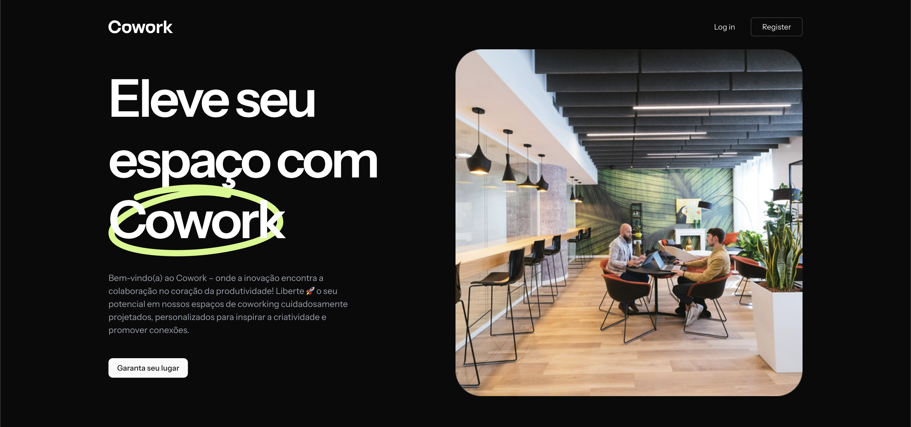
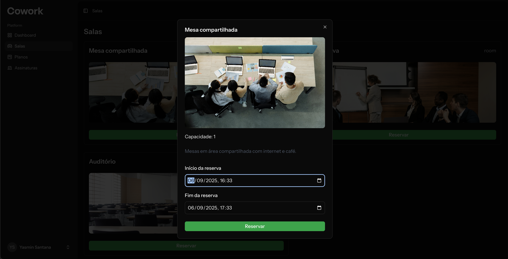
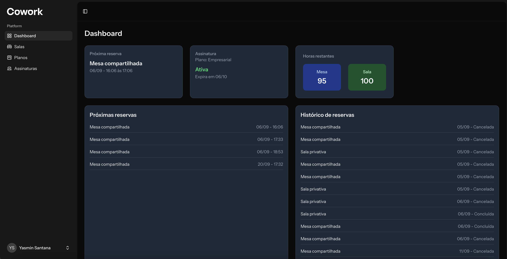

# Cowork Management System

[](https://laravel.com/)
[](https://reactjs.org/)
[](https://inertiajs.com/)

Sistema de gestão de coworking que permite reservas de salas e mesas, administração de planos e integração com usuários em uma plataforma moderna e intuitiva.

> ⚠️ **Aviso**: Este projeto foi criado apenas para fins de **prática e estudos pessoais**.

---

## 🔗 Teste a Aplicação

O sistema está disponível online no seguinte endereço:  
[Acessar Cowork](https://cowork-app-main.laravel.cloud/)

> 💡 Esse link aponta para a versão em produção do projeto, onde você pode testar todas as funcionalidades como cadastro de usuários, reservas de salas e mesas, gestão de planos, etc.

---

## 📌 Índice

- [🎯 Visão Geral](#visao-geral)
- [✨ Funcionalidades](#funcionalidades)
- [📐 Regras de Negócio](#regras-de-negocio)
- [🛠 Stack Tecnológica](#stack-tecnologica)
- [🚀 Instalação e Execução](#instalacao-e-execucao)
- [📜 Scripts Úteis](#scripts-uteis)
- [🖼 Screenshots](#screenshots)
- [📄 Licença](#licenca)

---

## Visao Geral

Este sistema foi desenvolvido para simplificar a gestão de coworkings.  
Usuários podem **reservar salas ou mesas**, contratar planos e acompanhar suas reservas, enquanto administradores conseguem visualizar e gerenciar toda a operação.

---

## Funcionalidades

- Cadastro e autenticação de usuários.
- Gestão de planos de assinatura.
- Listagem de salas e mesas disponíveis.
- Reserva de salas com **definição de data/hora**.
- Controle automático de disponibilidade (sem sobreposição de reservas).
- Painel do usuário para acompanhar reservas ativas.
- Integração com tema **dark mode**.
- Otimizações de **SEO** (Open Graph, meta tags).

---

## Regras de Negocio

As principais regras aplicadas no sistema são:

### Autenticacao

- Apenas usuários logados podem realizar reservas.
- Usuários podem editar seu perfil e gerenciar suas informações.

### Reservas

- O horário de **início da reserva** sempre é definido a partir de **agora + 10 minutos** por padrão.
- O **horário de término** deve ser, no mínimo, **1 hora após o início**.
- Não é permitido criar reservas que se sobreponham no mesmo espaço.

### Planos e Assinaturas

- Cada usuário pode estar vinculado a uma assinatura que contém um plano.
- Assinatura podem ter datas de início e fim.
- Apenas usuários com plano ativo podem reservar.

---

## Stack Tecnologica

- **Backend:** [Laravel 11](https://laravel.com/)
- **Frontend:** [React 18](https://react.dev/) + [Inertia.js](https://inertiajs.com/)
- **Banco de Dados:** MySQL
- **Estilização:** [TailwindCSS](https://tailwindcss.com/)
- **Componentes:** shadcn/ui + lucide-react (ícones)
- **Deploy:** [Laravel Cloud](https://laravelcloud.com/)

---

## Instalacao e Execucao

### Pre-requisitos

- PHP 8.2+
- Composer
- Node.js 18+
- MySQL

### Passos

```bash
# Clone o repositório
git clone https://github.com/santyasm/cowork.git

cd cowork

# Instale as dependências do backend
composer install

# Instale as dependências do frontend
npm install

# Configure o .env
cp .env.example .env
php artisan key:generate

# Rode as migrations + seeds
php artisan migrate --seed

# Inicie o servidor Laravel
php artisan serve

# Em outro terminal, rode o frontend
npm run dev
```

## Scripts Uteis

```bash
# Rodar migrations
php artisan migrate

# Rodar seeds
php artisan db:seed

# Limpar cache
php artisan optimize:clear

# Rodar build do frontend
npm run build
```

## Screenshots





## Licenca

📄 Este projeto está sob a licença MIT.

Feito com 💜 por Yasmin Santana.
